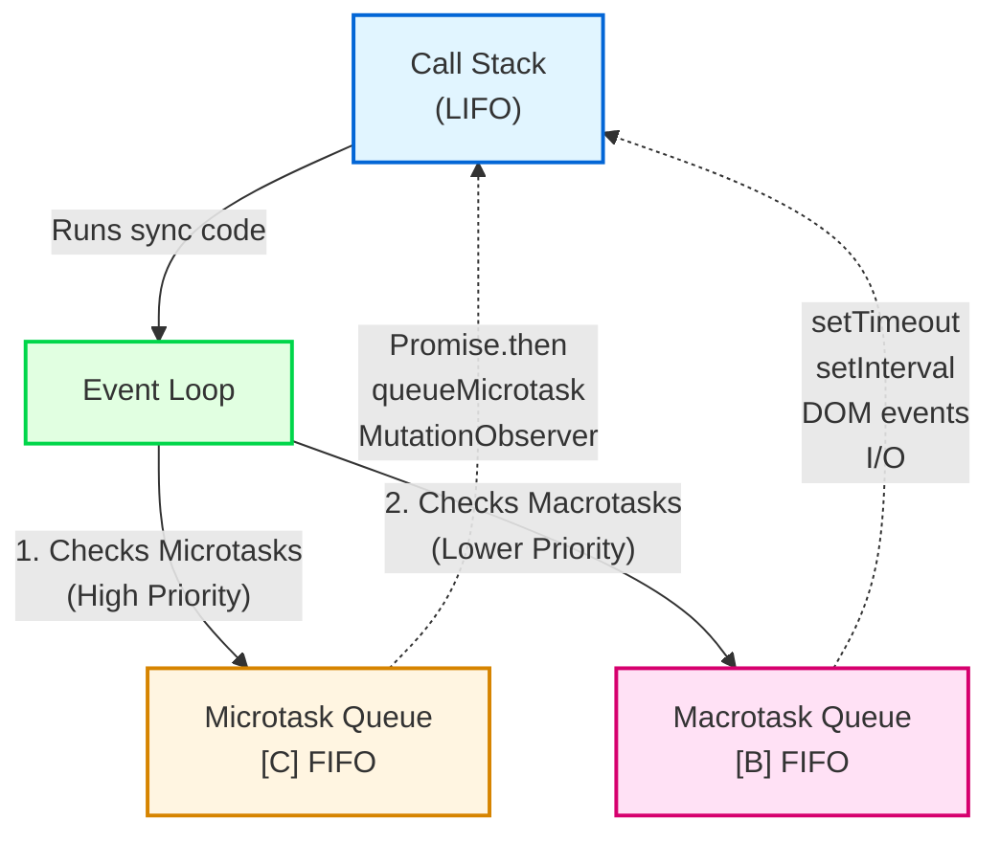

# JavaScript Interview
Here’s a complete, copy-paste friendly **guidebook** for JavaScript Interview preparation. It includes the *top JavaScript questions* plus high-frequency JavaScript coding and conceptual questions—with brief answers and sample code where applicable.

***

## **Note**
- Questions are categorized for fast reference
- Answers include concise explanations and JavaScript sample code snippets for direct practice

***

## **JavaScript/General Technical Interview Questions**

### 1. Explain the difference between a linked list and an array.
An array uses contiguous memory and allows fast random access (O(1)), but has fixed size. Linked lists are dynamically sized, each node points to the next, and accessing a particular index is O(n). Insertions/deletions are cheaper if you know the pointer.

### 2. How do you detect a cycle in a linked list?
**Floyd’s Cycle Detection Algorithm:**
```javascript
function hasCycle(head) {
  let slow = head, fast = head;
  while (fast && fast.next) {
    slow = slow.next;
    fast = fast.next.next;
    if (slow === fast) return true;
  }
  return false;
}
```

### 3. Describe time complexity of quicksort and when it performs poorly.
- **Average:** O(n log n)
- **Worst-case (already sorted data/bad pivots):** O(n^2)

### 4. Reverse a binary tree.
```javascript
function invertTree(root) {
  if (!root) return null;
  [root.left, root.right] = [invertTree(root.right), invertTree(root.left)];
  return root;
}
```

### 5. What is a race condition? How do you prevent it?
Race condition: Multiple threads/fibers modify shared data so output depends on unfair timing/scheduling. Prevent by using locks, mutexes, or synchronizing access to shared resources.

### 6. Explain memoization and give an example.
Caching expensive function calls to speed up repeat requests.
```javascript
function fib(n, memo = {}) {
  if (n <= 1) return n;
  if (memo[n]) return memo[n];
  memo[n] = fib(n - 1, memo) + fib(n - 2, memo);
  return memo[n];
}
```

### 7. Find the kth largest element in an array.
```javascript
function findKthLargest(nums, k) {
  nums.sort((a, b) => b - a);
  return nums[k - 1];
}
```

### 8. Differences between processes and threads.
Processes have separate memory, higher creation overhead; threads share process memory, lighter and communicate inside process.

### 9. What is dynamic programming?
Breaking problems into overlapping subproblems requiring caching/memoization. Used for optimization (e.g., Fibonacci, shortest path).

### 10. Largest square containing only 1s in a 0/1 matrix.
**Dynamic programming solution**: Create a DP table tracking size at each cell.

### 11. Design a URL shortening service.
Generate hash keys, store map in a DB, resolve collisions, ensure uniqueness, and enable quick redirects. Consider scaling and throughput.

### 12. What is a memory leak and how detected?
Memory is allocated but never freed (e.g., objects referenced forever). Detect via profiler, increase in memory usage, or tools like Chrome DevTools.

### 13. Stack vs. queue in JS
```javascript
// Stack (LIFO)
let stack = [];
stack.push(1);
stack.push(2);
console.log(stack.pop()); // 2

// Queue (FIFO)
let queue = [];
queue.push(1);
queue.push(2);
console.log(queue.shift()); // 1
```

### 14. Check if string has all unique characters.
```javascript
function isUnique(str) {
  let seen = new Set();
  for (let char of str) {
    if (seen.has(char)) return false;
    seen.add(char);
  }
  return true;
}
```

### 15. What are hash tables and how do they work?
Hash tables store key-value pairs, using a hash function to index—collisions handled by chaining or probing. Average lookup: $$O(1)$$.

### 16. Garbage collection basics.
Automatic process: JS engine finds unreachable objects and frees memory (“mark and sweep”, reference counting algorithms).

### 17. Abstraction vs. encapsulation.
- **Abstraction:** Hide implementation, expose only essentials.
- **Encapsulation:** Bundle data/methods, restrict direct access.

### 18. How to test an API endpoint?
Use unit/integration tests for inputs, outputs, error handling, status codes. Tools: Postman, Jest, Mocha.

### 19. Merge two sorted linked lists.
```javascript
function mergeLists(l1, l2) {
  let dummy = {next: null}, current = dummy;
  while (l1 && l2) {
    if (l1.val < l2.val) {
      current.next = l1; l1 = l1.next;
    } else {
      current.next = l2; l2 = l2.next;
    }
    current = current.next;
  }
  current.next = l1 || l2;
  return dummy.next;
}
```

### 20. What is a deadlock? How to prevent?
Multiple processes waiting forever on resources held by each other. Prevent by avoiding circular wait, hold-and-wait, or by timeouts.

### 21. SOLID principles
- **S**: Single Responsibility
- **O**: Open/Closed (extension/modification)
- **L**: Liskov Substitution
- **I**: Interface Segregation
- **D**: Dependency Inversion

### 22. First non-repeated character in a string.
```javascript
function firstNonRepeated(str) {
  let count = {};
  for (const c of str) count[c] = (count[c] || 0) + 1;
  for (const c of str) if (count[c] === 1) return c;
  return null;
}
```

### 23. Synchronous vs. asynchronous programming.
- Sync: Blocking, waits for each task to finish.
- Async: Non-blocking, can run other code while waiting (via callbacks, promises, async/await).

### 24. What are design patterns? Give examples.
Reusable solutions for common problems. E.g., Singleton, Factory, Observer, Strategy.

### 25. How to optimize a slow SQL query?
Check indexes, use EXPLAIN, limit columns, optimize joins, avoid SELECT *, rewrite inefficient logic.

### 26. BFS in a graph.
```javascript
function bfs(graph, start) {
  let visited = new Set(), queue = [start];
  visited.add(start);
  while (queue.length) {
    let node = queue.shift();
    for (let neighbor of graph[node]) {
      if (!visited.has(neighbor)) {
        visited.add(neighbor);
        queue.push(neighbor);
      }
    }
  }
}
```

### 27. How does HTTPS work?
Uses TLS/SSL for secure HTTP, server identity verified by digital certificate, symmetric key generated after handshake, secures data.

### 28. What is polymorphism?
Objects of multiple classes respond to the same method name differently.

### 29. How do you handle errors in code?
Use try/catch, validate inputs, log errors, throw informative exceptions.

### 30. CAP theorem
In distributed systems, can only guarantee 2 out of 3: Consistency, Availability, Partition tolerance during partitions.

***

## **Event Loop: Call Stack, Microtask Queue, and Macrotask Queue**

### Understanding JavaScript's Event Loop

JavaScript uses **one call stack** plus **multiple queues** to handle synchronous and asynchronous code execution.

### Call Stack (Synchronous execution)

- All normal code runs here in LIFO (Last In, First Out) order
- Stack must be empty before any async callbacks run

### Microtask Queue (High priority)

- Contains: `Promise.then/catch/finally`, `queueMicrotask`, `MutationObserver`
- Processed completely after each synchronous task
- FIFO (First In, First Out)

### Macrotask Queue (Lower priority)

- Contains: `setTimeout`, `setInterval`, DOM events, I/O
- Processed one at a time, after all microtasks are done
- FIFO (First In, First Out)

### Execution Order Example

```javascript
console.log('A');
setTimeout(() => console.log('B'), 0);
Promise.resolve().then(() => console.log('C'));
console.log('D');
```

**Output:**

```
A
D
C
B
```

### Why this order?

1. **Synchronous phase (Call Stack):**
   - `console.log('A')` executes → prints **A**
   - `setTimeout` schedules callback `B` in **Macrotask Queue**
   - `Promise.then` schedules callback `C` in **Microtask Queue**
   - `console.log('D')` executes → prints **D**

2. **Call stack is now empty, Event Loop checks queues:**
   - **Microtask Queue** has priority → runs `C` → prints **C**
   - Microtask Queue is empty

3. **Event Loop picks from Macrotask Queue:**
   - Runs callback `B` → prints **B**

### Visual Diagram


